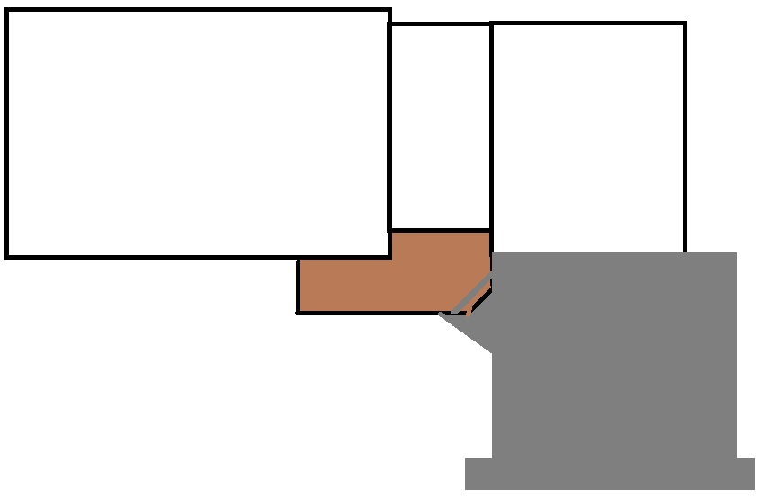

# home-improvement-project-status

## Kitchen project

### Before drywall

[ ] The sewer vent pipe in kitchen was replaced, but is in the same position.  This has to be moved into the wall

[ ] Wondering if we need to add supports for the right side of shelves for the coat closet

[ ] Can we fill floor gaps around bathroom

### Electrical needs

[ ] Replacement of fusebox

[ ] Outlet for hot water heater

[ ] 3 way for basement stairs

[ ] Change upstairs bedroom outlets to grounded (front of house)

### Plumbing

[ ] Need to install manifold

### Misc

[ ] Want details on the pantry doors, now that we cannot have the 24" doors originally planned

[ ] I need the change orders for the exhaust vent removal and fusebox replacement to sign

[ ] Need repairs on two front windows

[ ] Need to finalize transition place for drywall in stairs going to upstairs

## Front door + front porch + driveway project

- We approve the updated light fixtures, and are happy the wiring has been added to support 2 lights

[ ] Change front door back to the three smaller windows

[ ] Change back door to the 3/4 glass door

[ ] Need updated diagram showing a) larger deck b) no cement pad on side of house c) stairway as a 45 degree slice on the corner similar to following.

[ ] Updated quote for project(s)

## Upstairs bathroom project

- Not started

## Master project

- Not started

